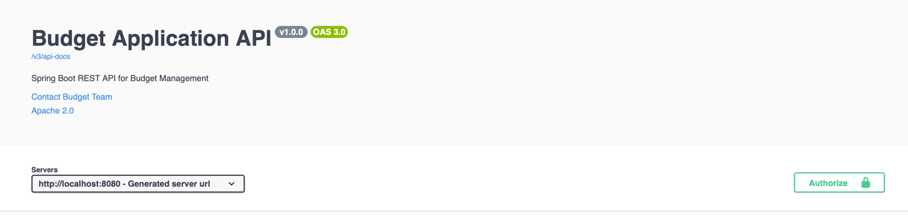

# Aplikacja do Zarządzania Budżetem

## Przegląd
Jest to Aplikacja do Zarządzania Budżetem zbudowana przy użyciu Spring Boot, która umożliwia użytkownikom zarządzanie ich osobistymi finansami. Aplikacja zapewnia funkcjonalność śledzenia przychodów, wydatków, transferów między kontami oraz kategoryzowania transakcji.

## Role Użytkowników (Kontrola Dostępu Oparta na Rolach)
Aplikacja implementuje Kontrolę Dostępu Opartą na Rolach (RBAC) z dwoma typami użytkowników:

1. **USER (UŻYTKOWNIK)**
   - Może dodawać i przeglądać obiekty

2. **ADMIN (ADMINISTRATOR)**
   - Może edytować i usuwać obiekty

## Stos Technologiczny

### Repozytorium Git
- Projekt jest utrzymywany w repozytorium Git

### Docker
Aplikacja jest skonteneryzowana przy użyciu Dockera:
- Docker Compose do orkiestracji aplikacji i usług bazodanowych

Aby uruchomić aplikację przy użyciu Dockera:
```bash
docker-compose up -d
```

### Maven
Projekt jest zgodny ze standardową strukturą Maven:
- Kod źródłowy w `src/main/java`
- Zasoby w `src/main/resources`
- Testy w `src/test/java`
- Zależności i konfiguracja budowy w `pom.xml`

Kluczowe zależności:
- Spring Boot 3.5.0
- Spring Data JPA
- Spring Security
- Spring Web
- Sterownik PostgreSQL
- Lombok
- Springdoc OpenAPI
- JUnit i Mockito do testowania
- TestContainers do testów integracyjnych

### Framework Spring
Aplikacja wykorzystuje różne komponenty frameworka Spring:

- **Spring Boot**: Do uruchamiania aplikacji i automatycznej konfiguracji
- **Spring Web**: Do budowania API RESTowych
- **Spring Data JPA**: Do dostępu do bazy danych i ORM
- **Spring Security**: Do uwierzytelniania i autoryzacji
- **Spring Validation**: Do walidacji danych wejściowych

### Swagger UI (Springdoc OpenAPI)
Dokumentacja API jest dostępna przez Swagger UI, skonfigurowany za pomocą Springdoc OpenAPI:
- Interaktywna dokumentacja API
- Możliwość testowania endpointów bezpośrednio z przeglądarki
- Wsparcie dla uwierzytelniania JWT w Swagger UI

Dostęp do Swagger UI pod adresem: `http://localhost:8080/swagger-ui.html`

### Hibernate + SQL
Aplikacja używa Hibernate jako narzędzia ORM z bazą danych PostgreSQL:
- Mapowania encji JPA
- Konfiguracja dialektu PostgreSQL
- Pula połączeń z HikariCP

#### Konfiguracja Bazy Danych
- Rozwój: Skonfigurowany w `application-dev.properties`
- Produkcja: Skonfigurowany w `application-prod.properties`
- Testowanie: Skonfigurowany w `application-test.properties`

#### Schemat Bazy Danych
Aplikacja używa kilku encji, w tym:
- User (Użytkownik)
- Account (Konto)
- Category (Kategoria)
- Expense (Wydatek)
- Income (Przychód)
- Transfer

**Uwaga**: Aplikacja obecnie nie implementuje Flyway ani Liquibase do migracji bazy danych, co jest wymaganiem do przyszłej implementacji.

### Testowanie
Aplikacja zawiera kompleksowe testy:
- Testy jednostkowe z JUnit 5 i Mockito
- Testy kontrolerów przy użyciu MockMvc
- Testy integracyjne z TestContainers dla PostgreSQL


Testy są zorganizowane według typu komponentu:
- Testy kontrolerów
- Testy serwisów
- Testy bezpieczeństwa
- Testy konfiguracji

## Uruchamianie Aplikacji

### Wymagania Wstępne
- Java 21
- Docker i Docker Compose
- Maven (opcjonalnie, jeśli nie używasz wrappera Maven)

### Tryb Deweloperski
```bash
./mvnw spring-boot:run -Dspring.profiles.active=dev
```

### Tryb Produkcyjny
```bash
docker-compose up -d
```

### Uruchamianie Testów
```bash
./mvnw test
```

## Endpointy API

Aplikacja udostępnia endpointy API RESTful dla:
- Rejestracji i uwierzytelniania użytkowników
- Zarządzania kontami
- Śledzenia wydatków
- Rejestrowania przychodów
- Transferów między kontami
- Zarządzania kategoriami


Szczegółowa dokumentacja API jest dostępna w Swagger UI pod adresem `http://localhost:8080/swagger-ui.html` podczas działania aplikacji.
